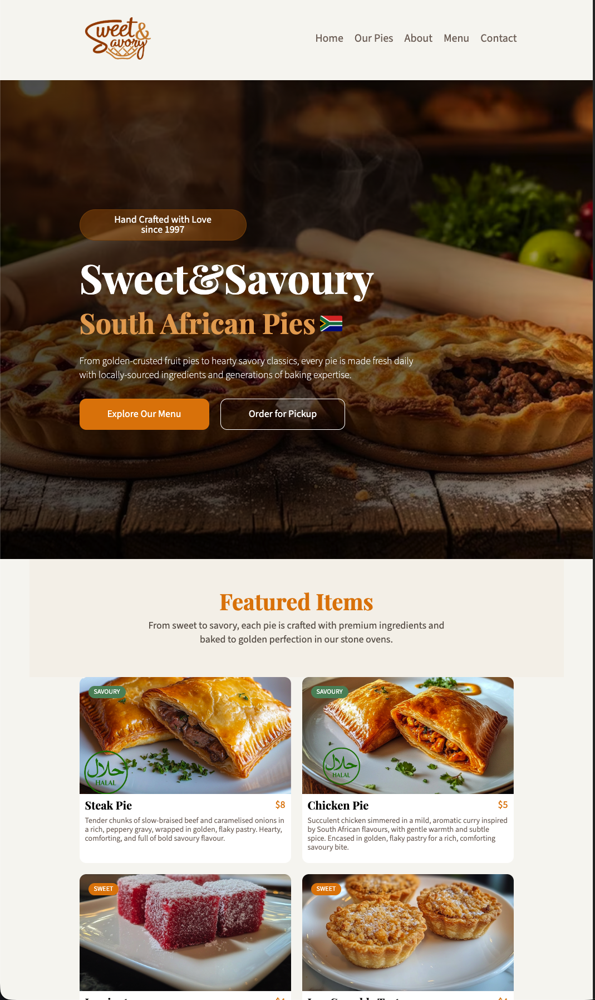

# Sweet & Savoury — Online Bakery Website

A production-ready single-page website for a family-run South African bakery, built with React and Vite. The site focuses on performance, accessibility, SEO, and clean front-end architecture.

## Demo

Live site: https://sweetnsavoury.netlify.app/



---

## Features

- Fully responsive layout (mobile, tablet, desktop)
- Single-page navigation with smooth scrolling
- SEO optimized (meta tags, sitemap.xml, robots.txt)
- Accessible markup (semantic HTML, ARIA labels where appropriate)
- Performance-focused asset loading (optimized images and modern formats)
- Clean, modular component architecture

---

## Tech Stack

### Frontend
- React
- Vite
- SCSS (modular styling)

### Tooling & Platform
- ESLint (code quality)
- Prettier (formatting consistency)
- Netlify (CI/CD deployment & hosting)

---

Primary goals:

- Build a production-quality React SPA
- Apply SEO and accessibility best practices
- Optimize performance and asset delivery
- Structure a maintainable component architecture
- Deliver a real business-facing product

---

## Installation & Local Development

```bash
git clone https://github.com/your-username/sweet-and-savoury.git
cd sweet-and-savoury
npm install
npm run dev

